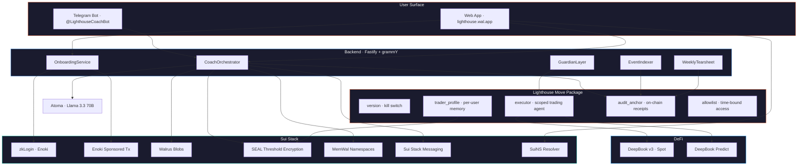
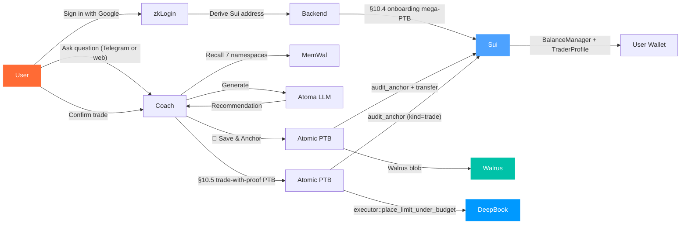
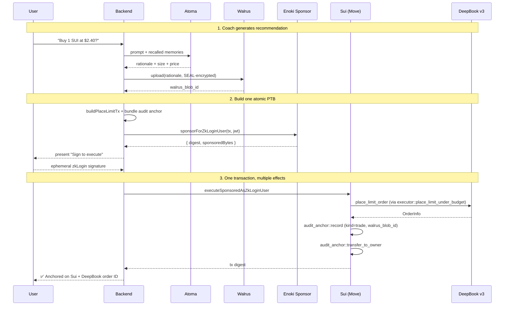

<p align="center">
  <picture>
    <source media="(prefers-color-scheme: dark)" srcset="web/public/assets/logo-white.svg">
    
  </picture>
</p>

<p align="center">
  <strong>An AI trading coach that remembers.</strong>
</p>

<p align="center">
  <em>Verifiable agent memory on Walrus, executing real trades on DeepBook.</em>
</p>

<p align="center">
  <a href="#quick-start">Quick Start</a> &nbsp;&middot;&nbsp;
  <a href="#capabilities">Capabilities</a> &nbsp;&middot;&nbsp;
  <a href="#architecture">Architecture</a> &nbsp;&middot;&nbsp;
  <a href="#how-it-works">How It Works</a> &nbsp;&middot;&nbsp;
  <a href="#smart-contracts">Contracts</a> &nbsp;&middot;&nbsp;
  <a href="#api-endpoints">API</a>
</p>

<br />

<p align="center">
  
  
  
  
  
  
</p>

<p align="center">
  
  
  
  
  
  
  
  
  
</p>

<p align="center">
  
  
  
</p>

<p align="center">
  <strong>Live demo:</strong> <a href="https://t.me/LighthouseCoachBot">@LighthouseCoachBot</a>
  &nbsp;&middot;&nbsp;
  <strong>Testnet package:</strong> <a href="https://testnet.suivision.xyz/package/0x150ae38deaf5a71e04106a6487a3779099ac1f19eeaffc1b7e83b6c43157f744"><code>0x150ae38d…</code></a>
</p>

---

## The Problem

Every active DeFi user runs the same loop across every app they touch:

- Re-explain risk preference to a Telegram bot
- Re-enter sizing rules on a web DEX
- Lose yesterday's context on a desktop terminal
- Lose money on trades their own past notes would have prevented

Their alpha lives in their head. Their apps know nothing.

AI agents promise to remember, but **today's "AI memory" is a vendor cache** — opaque, deletable, unrevocable, and lost the day the company turns off the lights.

Lighthouse is the missing layer: **portable, verifiable, revocable memory** for AI trading agents on Sui.

---

## Capabilities

<table>
  <tr>
    <td width="25%" align="center">
      <br />
      
      <h3>Remember</h3>
      <code>memwal · seal</code>
      <br /><br />
      Every coaching session writes to 7 named MemWal namespaces on Walrus, SEAL-encrypted with your keys. Cross-device, cross-session, cross-chain. Yours to query forever.
      <br /><br />
    </td>
    <td width="25%" align="center">
      <br />
      
      <h3>Recommend</h3>
      <code>atoma · llama 3.3 70b</code>
      <br /><br />
      Tell the coach what you want in plain English. It recalls your prior context, sizes the trade against your risk profile, and proposes the order. Inference runs on Atoma decentralized compute.
      <br /><br />
    </td>
    <td width="25%" align="center">
      <br />
      
      <h3>Execute</h3>
      <code>deepbook v3 · executor</code>
      <br /><br />
      A capability-scoped ExecutorAgent places the order on DeepBook within budgets enforced in Move: per-trade cap, per-day cap, whitelisted pools, expiry. The contract is the authority.
      <br /><br />
    </td>
    <td width="25%" align="center">
      <br />
      
      <h3>Prove</h3>
      <code>audit_anchor · ptb</code>
      <br /><br />
      The trade and its rationale anchor in the same atomic PTB. The on-chain receipt points at the SEAL-encrypted Walrus blob. The decision is provable before the trade settles.
      <br /><br />
    </td>
  </tr>
</table>

---

## Architecture

### System Overview



### User Flow



### Atomic Trade-With-Proof PTB



---

## How It Works

### Verifiable Memory Layer (MemWal + SEAL + Walrus)

Lighthouse keeps **seven semantic namespaces** per user on Walrus:

| Namespace | What lives there |
|:----------|:-----------------|
| `lighthouse:risk-profile` | Risk tolerance, drawdown cap, position sizing rules |
| `lighthouse:trades` | Every executed trade with rationale and outcome |
| `lighthouse:lessons` | Lessons learned, things to never repeat |
| `lighthouse:goals` | What the user is trying to achieve |
| `lighthouse:holdings` | Snapshots of portfolio state over time |
| `lighthouse:personality` | Coach calibration to user communication style |
| `lighthouse:preferences` | UI defaults, notification preferences |

Each namespace is a MemWal vector store backed by Walrus. Every recall issues a parallel vector-similarity query against the relevant namespaces. The top-K results are SEAL-decrypted on the fly using the user's threshold key shares and injected into the Atoma prompt.

The user's TraderProfile carries an on-chain cache of the latest Walrus blob ID per namespace, so cross-session reads do not require an off-chain indexer.

### Scoped Execution (Move executor)

The `executor::place_limit_under_budget<Base, Quote>` function asserts, IN MOVE:

```move
// signer must be the agent_address recorded on the agent
assert!(ctx.sender() == agent.agent_address, ENotAgent);

// must not be revoked
assert!(!agent.revoked, ERevoked);

// must reference the right BalanceManager
assert!(object::id(bm) == agent.balance_manager_id, EBalanceManagerMismatch);

// must not be expired
assert!(now < agent.expires_at_ms, EExpired);

// pool must be whitelisted
assert!(pool_id in agent.allowed_pools, EPoolNotAllowed);

// notional must fit per-trade cap
assert!(notional <= agent.max_notional_per_trade, EBudgetExceeded);

// notional must fit rolling 24h cap
assert!(agent.spent_today + notional <= agent.max_notional_per_day, EBudgetExceeded);
```

These guards live in Move, not in the backend. The backend cannot bypass them; the chain rejects any tx that violates them. Revocation is a one-tx kill switch the user can trigger anytime.

### Atomic PTB Composition

Every backend write that touches user state is **one PTB with multiple Move calls** so the audit anchor cannot be separated from the action it audits:

| Logical action | Move calls in one PTB | Builder |
|:---------------|:---------------------|:--------|
| Onboard user | `balance_manager::new` → `deposit<USDC>` → `deposit<DEEP>` → `trader_profile::create` → `share` → `public_share_object<BM>` | `buildOnboardingTx` |
| Memory write | `trader_profile::update_blob` → `audit_anchor::record` → `transfer_to_owner` | `buildMemoryWriteWithProofTx` |
| Trade | `executor::place_limit_under_budget` → `audit_anchor::record(kind=trade)` → `transfer_to_owner` | `buildPlaceLimitTx` |
| Revoke agent | `executor::revoke` → `audit_anchor::record` → `transfer_to_owner` | `buildRevokeAgentWithProofTx` |
| Weekly settlement (N users) | `audit_anchor::record × N` + `transfer × N` | `buildWeeklyAuditBatchTx` |
| Predict mint | `market_key::new` → `predict::mint` → `audit_anchor::record(kind=trade)` → `transfer` | `buildPredictMintTx` |
| Display registration (4 types) | `display::new_with_fields × 4` + `update_version × 4` + `transfer × 4` | `setup-display-objects.ts` |

### Sponsored Transactions (Enoki)

Two sponsor paths cover every user-signed transaction:

| Path | Function | Use case |
|:-----|:---------|:---------|
| Raw sender | `sponsorForAddress(tx, sender)` | Known Sui address (zkLogin-derived) |
| JWT branch | `sponsorForZkLoginUser(tx, jwt)` | Fresh OAuth callback, sender derived from Google JWT |

Allowed Move targets are whitelisted in `lib/enoki.ts`, including all Lighthouse entries plus DeepBook Predict's `predict::create_manager`, `mint`, `redeem`, `predict_manager::deposit`. Coach-paid flows (Walrus upload + audit anchor recording, Telegram bot 💾 button) bypass Enoki and use the backend's own keypair.

---

## Tech Stack

| Layer | Technology | Purpose |
|:------|:-----------|:--------|
| **Runtime** | [Bun](https://bun.sh/) | Package manager, test runner, script executor |
| **Frontend** | [TanStack Start](https://tanstack.com/start), React 19, [Vite 7](https://vite.dev/) | SSR-capable meta-framework, file-based routing |
| **UI** | [Tailwind CSS 4](https://tailwindcss.com/), [HeroUI](https://heroui.com/), [GSAP](https://gsap.com/), [Lenis](https://lenis.darkroom.engineering/), Motion, [MDX](https://mdxjs.com/) | Styling, components, scroll animation |
| **Backend** | [Fastify 5](https://fastify.dev/), [Prisma 7](https://prisma.io/) + PostgreSQL | HTTP server with rate limiting, ORM with `@prisma/adapter-pg` |
| **Telegram** | [grammY](https://grammy.dev/) | Telegram bot framework (webhook + long-polling) |
| **AI** | [Atoma SDK](https://atoma.network/) | Llama 3.3 70B inference on decentralized compute |
| **Chain** | [@mysten/sui](https://sdk.mystenlabs.com/typescript) | Sui SDK (gRPC + JSON-RPC clients, PTB builder, keypairs, zkLogin) |
| **Trading** | [@mysten/deepbook-v3](https://docs.sui.io/standards/deepbookv3) | DeepBook v3 SDK (spot orderbook, balance manager) |
| **Predict** | [DeepBook Predict](https://docs.sui.io/onchain-finance/deepbook-predict) | Binary expiry prediction markets on Sui |
| **Storage** | [@mysten/walrus](https://docs.wal.app/), MemWal | Decentralized blob storage, vector memory namespaces |
| **Privacy** | [@mysten/seal](https://github.com/MystenLabs/seal) | Threshold encryption with key servers |
| **Auth** | [Enoki SDK](https://docs.enoki.mystenlabs.com/), zkLogin | OAuth → Sui address, sponsored transactions |
| **Naming** | [@mysten/suins](https://docs.suins.io/) | `.sui` name resolution, tearsheet routing |
| **Messaging** | [@mysten/sui-stack-messaging](https://github.com/MystenLabs/sui-stack-messaging) | SEAL-encrypted group messages with Walrus archival |
| **Contracts** | [Sui Move 2024](https://docs.sui.io/concepts/sui-move-concepts) | 5 modules, ~700 lines, 100% test coverage |

---

## Project Structure

```
lighthouse/
 |
 |- lighthouse_contract/         Move smart contracts
 |   |- sources/                 5 modules (version, trader_profile, executor, audit_anchor, allowlist)
 |   |- tests/                   43 unit tests, all passing
 |   +- Move.toml                Package manifest with DeepBook v3 pinned dep
 |
 |- backend/                     Fastify + grammY backend
 |   |- index.ts                 Entry: route registration, worker startup, bot lifecycle
 |   |- src/
 |   |   |- routes/              20 route files (sponsor, onboarding, coach, profile, etc.)
 |   |   |- services/            CoachOrchestrator, GuardianLayer, EventIndexer, WeeklyTearsheet
 |   |   |- workers/             node-cron jobs (error log cleanup, weekly tearsheet)
 |   |   |- middlewares/         authMiddleware
 |   |   |- lib/                 22 integration files (sui, deepbook, walrus, seal, memwal,
 |   |   |                       enoki, atoma, telegram, predict, messaging, ...)
 |   |   |- config/              Centralized env + boot-time validation
 |   |   +- utils/               Error handler, validation, time, misc
 |   |- prisma/                  Schema + migrations
 |   +- scripts/                 Smoke tests, setup helpers, init scripts
 |
 |- web/                         TanStack Start landing + app
 |   |- src/
 |   |   |- routes/              File-based routing (index, protocol, docs/, activity, terms, privacy)
 |   |   |- components/
 |   |   |   |- landing/         Hero, WhatIsLighthouse, PrimitivesGrid, Walkthrough, FooterCard
 |   |   |   |- protocol/        Layer cards (memory, encryption, execution, audit)
 |   |   |   |- docs/            MDX-rendered protocol documentation
 |   |   |   |- elements/        MaskReveal, WordReveal, AnimateComponent
 |   |   |   +- ui/              Card, Button, EyebrowTag, StatusPulseDot, Skeleton
 |   |   |- docs/                MDX content (the Lighthouse protocol whitepaper)
 |   |   |- providers/           HeroUI, Lenis smooth scroll, Theme
 |   |   |- constants/           Icons (14-icon allowlist), motion constants
 |   |   +- styles.css           Tailwind 4 theme tokens (light + dark)
 |   +- public/                  Logo (svg, multiple variants), fonts, manifest
 |
 |- memory/                      Local research notes (gitignored)
 +- docs/                        Hackathon docs, design references
```

> Each subdirectory has its own README:
> - [`backend/README.md`](backend/README.md) - Full API reference, services, libs, database schema
> - [`web/README.md`](web/README.md) - Frontend architecture, routing, design system, animation
> - [`lighthouse_contract/README.md`](lighthouse_contract/README.md) - Move modules, testing, deployment

---

## Smart Contracts

> Deployed on **Sui Testnet** · Package `0x150ae38d…3157f744`

> **Package IDs:** The Move package has been upgraded. Use these two IDs depending on context:
> - **original-id** (use for Move call targets): `0x150ae38deaf5a71e04106a6487a3779099ac1f19eeaffc1b7e83b6c43157f744`
> - **published-at** (latest upgrade, v3): `0x3865cee0905149480eb3394e6e31aa709093b5134d49e9e701cf4565d5822831`

| Object | Type | ID | Purpose |
|:-------|:-----|:---|:--------|
| Package | Immutable | [`0x150ae38d…`](https://testnet.suivision.xyz/package/0x150ae38deaf5a71e04106a6487a3779099ac1f19eeaffc1b7e83b6c43157f744) | Lighthouse Move bytecode (5 modules) |
| Version | Shared | [`0x3b989979…`](https://testnet.suivision.xyz/object/0x3b989979ca29e58d39e547687d5538f49ac7db463565111d8a6fd909ac2e78aa) | Live version gate, asserted by every entry function |
| AdminCap | Owned | [`0x0068dccd…`](https://testnet.suivision.xyz/object/0x0068dccdafdf7df48bf7ab2ef1f4053ee7d23faceea7faa4c63a21be0301a25a) | Future migrations |
| UpgradeCap | Owned | [`0x43ee29bf…`](https://testnet.suivision.xyz/object/0x43ee29bf12e2a0c89a83ab47d59be76831c2a1b8436907c2f8a5be07a1f0a0bf) | Sui upgrade authority |
| Publisher | Owned | [`0x7ae5aafa…`](https://testnet.suivision.xyz/object/0x7ae5aafa2263bb40faf50f00a6c15dcdd26ec80d21609623c1b6be1ad91255f5) | Display object authority |

**Display objects** (wallets render these as rich cards):

| Type | Display object ID |
|:-----|:------------------|
| `executor::ExecutorAgent` | [`0xfc724021…`](https://testnet.suivision.xyz/object/0xfc724021f420a801dd79e938cc862a0a1cd1e068efdf0e42012b970f1405fb29) |
| `trader_profile::TraderProfile` | [`0xadc227cf…`](https://testnet.suivision.xyz/object/0xadc227cf70732cc690b11ba75ec6970863d720ca2991a9a7a53026252c8420a4) |
| `audit_anchor::AuditAnchor` | [`0x2c96f315…`](https://testnet.suivision.xyz/object/0x2c96f31542279bcdb271c6902153926b9f7c8d28ab9922f9dc9e51f073dd8da6) |
| `allowlist::AuditCap` | [`0x5d37b752…`](https://testnet.suivision.xyz/object/0x5d37b752a6f76e594653841d0e8f6e9aa11f694936d2df2424b24460f03a9d81) |

See [`lighthouse_contract/README.md`](lighthouse_contract/README.md) for the full module reference.

---

## API Endpoints

| Method | Path | Purpose | Auth | Sponsor |
|:------:|:-----|:--------|:----:|:-------:|
| GET | `/` | Health check | — | — |
| POST | `/auth/telegram/verify` | Verify Telegram WebApp initData; issue JWT + Google OAuth URL | — | — |
| POST | `/auth/web/start` | Begin web zkLogin flow → oauthUrl + nonce | — | — |
| POST | `/auth/web/set-cookie` | Burn handoff token, set httpOnly `lh_jwt` cookie | — | — |
| POST | `/auth/web/logout` | Clear `lh_jwt` cookie | — | — |
| GET | `/oauth/callback` | Google OAuth callback → derive Sui address, bind TraderProfile | — | — |
| POST | `/onboarding/build-tx` | Build §10.4 mega-PTB (BalanceManager + TraderProfile) | ✅ | ✅ |
| POST | `/onboarding/finalise` | Persist object IDs after tx execution | ✅ | — |
| POST | `/profile/me` | — | GET | `/profile/me` |
| GET | `/profile/me` | Return TraderProfile for signed-in user | ✅ | — |
| POST | `/profile/update-blob` | Atomic memory write + audit anchor | ✅ | ✅ |
| POST | `/profile/record-trader-profile-id` | Store profile_object_id | ✅ | — |
| POST | `/profile/record-balance-manager-id` | Store balance_manager_id | ✅ | — |
| POST | `/profile/record-executor-agent-id` | Store executor_agent_id | ✅ | — |
| POST | `/coach/recommend` | Atoma inference + Guardian + MemWal recall + optional anchor | — | — |
| GET | `/coach/chat` | SSE token stream from Atoma | — | — |
| GET | `/agent/snapshot` | Cached on-chain ExecutorAgent state (60 s TTL) | ✅ | — |
| POST | `/agent/revoke` | Atomic revoke + audit anchor | ✅ | ✅ |
| POST | `/sponsor/place-limit` | Build atomic limit order + audit anchor PTB | — | ✅ |
| POST | `/sponsor/execute` | Execute sponsored tx (digest + signature) | — | ✅ |
| POST | `/sponsor/dry-run-place-limit` | Simulate place-limit via devInspect | — | — |
| POST | `/sponsor/dry-run` | Generic dry-run (memory-write, revoke-agent, predict flows) | ✅ | — |
| POST | `/memwal/begin` | Generate delegate key; return create_account PTB | ✅ | ✅ |
| POST | `/memwal/step2` | Build add_delegate_key PTB after execution | ✅ | ✅ |
| POST | `/multi-agent/grant-copy-trader` | Sponsored grant_copy_trader PTB | ✅ | ✅ |
| POST | `/multi-agent/revoke-copy-trader` | Sponsored revoke_copy_trader PTB | ✅ | ✅ |
| GET | `/multi-agent/grants/:address` | Read copy-trader grants for address | ✅ | — |
| POST | `/multi-agent/grant-audit` | Sponsored grant_audit (mint AuditCap) | ✅ | ✅ |
| POST | `/multi-agent/revoke-audit` | Sponsored revoke_audit | ✅ | ✅ |
| GET | `/predict/markets` | Proxy predict server market list (60 s cache) | — | — |
| GET | `/predict/positions/:managerId` | Proxy predict server positions | ✅ | — |
| POST | `/predict/onboard` | Sponsored create_manager | ✅ | ✅ |
| POST | `/predict/deposit` | Sponsored predict_manager::deposit | ✅ | ✅ |
| POST | `/predict/mint` | Sponsored atomic mint + audit anchor | ✅ | ✅ |
| POST | `/predict/redeem` | Sponsored atomic redeem + audit anchor | ✅ | ✅ |
| POST | `/predict/supply` | Sponsored predict::supply (LP) | ✅ | ✅ |
| POST | `/predict/withdraw` | Sponsored predict::withdraw (LP) | ✅ | ✅ |
| GET | `/messaging/health` | Probe Sui Stack Messaging relayer | — | — |
| POST | `/messaging/group-create` | Coach creates and shares a messaging group | ✅ | — |
| POST | `/messaging/send` | Coach sends message to group | ✅ | — |
| GET | `/suins/resolve/:name` | Resolve .sui name → Sui address | — | — |
| POST | `/suins/set-walrus-site-id` | Sponsored setUserData(walrus_site_id) | ✅ | ✅ |
| POST | `/suins/record-nft-id` | Store suins_nft_id + suins_name | ✅ | — |
| GET | `/tearsheet/list/:address` | List weekly tearsheets for address | — | — |
| GET | `/tearsheet/by-suins/:name/:week` | Tearsheet by SuiNS name and week | — | — |
| GET | `/tearsheet/by-address/:address/:week` | Tearsheet by address and week | — | — |
| GET | `/proof/recommendation/:id` | Verifiable proof export for a recommendation | — | — |
| GET | `/proof/trade/:id` | Verifiable proof export for a trade | — | — |
| POST | `/tg/webhook` | Telegram bot webhook (secret-token validated) | secret | — |
| GET | `/deepbook/pools` | List supported pools (SUI_DBUSDC, DEEP_SUI, WAL_SUI) | — | — |
| GET | `/deepbook/book/:poolKey` | Cached orderbook snapshot (1.5 s TTL) | — | — |
| GET | `/activity/recent` | Recent on-chain activity (max 20 events) | — | — |
| GET | `/api/stats` | Platform stats (blobs, decisions, epochs) | — | — |

See [`backend/README.md`](backend/README.md) for request/response schemas.

---

## Quick Start

### Prerequisites

| Tool | Version | Link |
|:-----|:--------|:-----|
| Bun | 1.1+ | [bun.sh](https://bun.sh/) |
| Sui CLI | 1.73+ | [docs.sui.io/install](https://docs.sui.io/guides/developer/getting-started/sui-install) |
| Walrus CLI | 1.50+ | [docs.wal.app](https://docs.wal.app/docs/getting-started) |
| Docker Desktop | 24+ | [docker.com](https://www.docker.com/products/docker-desktop/) |
| PostgreSQL | 15+ | [postgresql.org](https://www.postgresql.org/) |

### 1. Clone and install

```bash
git clone https://github.com/your-org/lighthouse.git
cd lighthouse

cd backend && bun install
cd ../web && bun install
```

### 2. Configure environment

Copy the template and fill in API keys (Atoma, Enoki, Telegram, Google OAuth):

```bash
# See backend/BACKEND_ENV_TEMPLATE.md for the full template
cp backend/.env.example backend/.env
```

Required keys (see [`backend/ENV_SETUP.md`](backend/ENV_SETUP.md) for full reference):

| Key | Purpose |
|:----|:--------|
| `DATABASE_URL` | PostgreSQL connection string |
| `JWT_SECRET` | Session signing |
| `SUI_NETWORK` | `testnet` |
| `LIGHTHOUSE_PACKAGE_ID` | Already published: `0x150ae38d…` |
| `LIGHTHOUSE_VERSION_OBJECT_ID` | Already shared: `0x3b989979…` |
| `ATOMASDK_BEARER_AUTH` | Atoma API key |
| `ENOKI_PRIVATE_KEY` | Enoki sponsor key |
| `TELEGRAM_BOT_TOKEN` | `@BotFather` token |
| `RELAYER_URL` | `http://localhost:3000` (after `docker compose up`) |

### 3. Set up the database

```bash
cd backend
bun run db:push    # apply Prisma schema
```

### 4. Start the relayer (for Sui Stack Messaging)

```bash
git clone https://github.com/MystenLabs/sui-stack-messaging.git ~/sui-stack-messaging
cd ~/sui-stack-messaging/relayer
cp .env.example .env
# fill GROUPS_PACKAGE_ID=0xba8a26d42bc8b5e5caf4dac2a0f7544128d5dd9b4614af88eec1311ade11de79
docker compose up -d
```

### 5. Run

```bash
# Terminal 1: backend (port 3700)
cd backend && bun run dev

# Terminal 2: frontend (port 3200)
cd web && bun run dev
```

Open [http://localhost:3200](http://localhost:3200) for the landing page, or message [@LighthouseCoachBot](https://t.me/LighthouseCoachBot) for the live testnet bot.

---

## Commands

<details>
<summary><strong>Backend</strong></summary>

```bash
bun run dev              # Dev server (port 3700, watch mode)
bun run start            # Production start
bun run typecheck        # tsc --noEmit
bun run db:push          # Push Prisma schema
bun run db:generate      # Regenerate Prisma client
bun run smoke            # Dry-run smoke test (no on-chain writes)
bun run smoke:live       # Live smoke against testnet
bun run setup-bot        # Push Telegram bot config to @BotFather
```

</details>

<details>
<summary><strong>Frontend</strong></summary>

```bash
bun dev        # Dev server (port 3200, HMR)
bun build      # Production build (SSR via Nitro)
bun preview    # Preview production build
bun lint       # ESLint
bun format     # Prettier
bun check      # Format + lint fix
bun test       # Vitest
```

</details>

<details>
<summary><strong>Contracts</strong></summary>

```bash
sui move build                              # Compile all modules
sui move test                               # Run 43 unit tests
sui client publish --gas-budget 500000000   # Publish (or upgrade with UpgradeCap)
```

</details>

---

## Hackathon

<table>
  <tr>
    <td><strong>Event</strong></td>
    <td>Sui Overflow 2026</td>
  </tr>
  <tr>
    <td><strong>Theme</strong></td>
    <td>Build What Matters</td>
  </tr>
  <tr>
    <td><strong>Tracks</strong></td>
    <td>Agentic AI · DeepBook · Walrus (headline)</td>
  </tr>
  <tr>
    <td><strong>Submission</strong></td>
    <td>June 21, 2026</td>
  </tr>
  <tr>
    <td><strong>Prize pool</strong></td>
    <td>$250,000+ direct + $250,000+ post-hackathon resources</td>
  </tr>
  <tr>
    <td><strong>Live demo</strong></td>
    <td><a href="https://t.me/LighthouseCoachBot">@LighthouseCoachBot</a></td>
  </tr>
</table>

---

<p align="center">
  <picture>
    <source media="(prefers-color-scheme: dark)" srcset="web/public/logo-white.svg">
    
  </picture>
</p>

<p align="center">
  <strong>Lighthouse</strong><br/>
  <em>An AI trading coach that remembers.</em>
</p>

<p align="center">
  <sub>Apache-2.0 License · Built for Sui Overflow 2026</sub>
</p>
